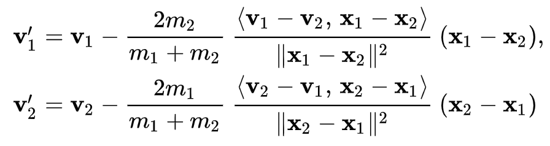

# My Project

This program enables users to generate a simulation of particles (balls) interacting in a two dimensional
space. Each ball is given x and y position, velocity, and acceleration components. As balls collide with
walls or other balls, these components get updated accordingly. Before rendering, multiple settings can be 
tweaked, including but not limited to # of balls, # of frames, frame rate, and ball elasticity (Net 
energy loss component). 

A higher-quality video of an example simulation can be viewed here:   
https://youtu.be/f1EE3UBr1vY?si=pSDD7Rd6NJf6If-Y

**Collision Detection:**
For each frame, the system must look for potential collisions. Otherwise, objects would pass right 
though eachother or escape outside the screen. To maximize runtime efficiency, I implemented the 
**Sweep and Prune** collision detection algorithm which runs on average O(nlogn), where n is the number of
balls. This asymptotic runtime is much better than its counterpart O(n^2) if we were to instead check 
for collisions between all possible pairs of balls.

**Collision Response:**
When it is detected that two balls have collided, a collision response mechanism is executed. Given the 
radii and the initial x and y component positions and velocitities of both balls, we determine the final 
(new) values of these components using the following formula:

https://en.wikipedia.org/wiki/Elastic_collision

## Installation

This project is currently made specifically for MacOS. To use this project on your local machine, 
first clone this repository (containing submodules) using the following command:

git clone --recurse-submodules https://github.com/asarainbarton/Particle-Collision-Simulator.git

Next, make sure you have HomeBrew installed and then install any dependencies:

brew update  
brew install cmake sdl2 opencv  

Next, generate the build files for running CMake:

cd build  
cmake ..  

## Usage

Now that your project has all the necessary build files, edit the 'config.json' file as you see fit.
This is where all the settings are contained pertaining to how you want your simulation to be run.
Next, simply compile your program inside the 'build' directory using the following command:

make

You should now see a generated executable file named 'simulation'. To execute, simply run the executable:

./simulation

If you plan on modifying your settings frequently, it may be more efficient to simply execute the 
compilation and execution step at the same time:

make && ./simulation

## Contributing

If you want to be a contributor, feel free to submit a pull request! If your request gets denied, you may
still modify a copy of this repository as you wish and use it for any of your personal projects. If you
notice any bugs, report them to anyissuereports@gmail.com

## License

This project is licensed under the [MIT License](LICENSE.txt).

## Author

Asa Barton

